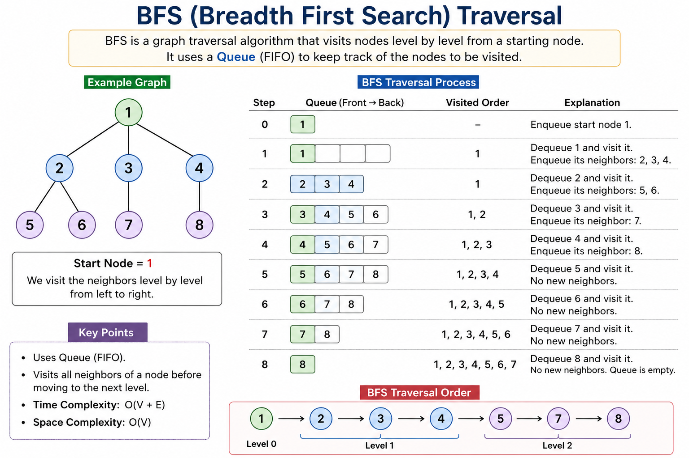

# Breadth First Search (BFS)

## What is BFS?

Breadth First Search (BFS) is a graph traversal algorithm that visits vertices level by level, starting from a source vertex. It uses a **Queue (FIFO)** to process vertices in the order they are discovered.


## When to Use BFS

* Traverse a graph level by level.
* Find the shortest path in an unweighted graph.
* Find all nodes reachable from a source.
* Find connected components.
* Solve grid and maze problems.


## Prerequisites

* Graph Representation (Adjacency List)
* Queue
* Visited Array


## Intuition

Instead of going as deep as possible like DFS, BFS first visits all immediate neighbors of the current node, then moves to the next level.

```
Level 0:    1

Level 1:   2   3

Level 2:  4  5   6
```

Traversal:

```
1 → 2 → 3 → 4 → 5 → 6
```


## Algorithm

1. Mark the source as visited.
2. Push the source into the queue.
3. While the queue is not empty:

   * Pop the front node.
   * Process it.
   * Visit every unvisited neighbor.
   * Mark each neighbor as visited.
   * Push them into the queue.


## Complexity

| Operation               | Complexity |
| ----------------------- | ---------- |
| Time (Adjacency List)   | O(V + E)   |
| Time (Adjacency Matrix) | O(V²)      |
| Space                   | O(V)       |

Where:

* V = Number of vertices
* E = Number of edges

## Example



## Common Applications

* Shortest Path (Unweighted Graph)
* Connected Components
* Bipartite Graph Checking
* Cycle Detection (Undirected Graph)
* Multi-source BFS
* Flood Fill
* Maze/Grid Problems
* Level Order Traversal of Trees


## Common Mistakes

* Forgetting the visited array.
* Marking a node as visited after pushing duplicates.
* Mixing 0-based and 1-based indexing.
* Using a stack instead of a queue.


## Related Topics

* DFS
* Shortest Path
* Graph Representation
* Queue
